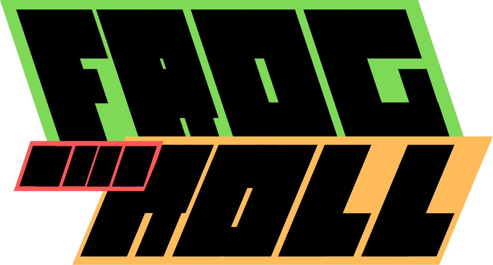

<p align="center">
  
</p>

<p align="center">
  <a href="https://unity.com/"></a>
  
  
</p>

<p align="center">
  
  
  
  
</p>

<p align="center">
  👉 <a href="https://z1c4z.github.io/Frog-and-roll/"><strong>Visit Our Website</strong></a>
</p>

---

> **A Rhythm-Based Platformer Game Made with Unity**

## 🧩 About the Game

**Frog'n Roll** is an exciting rhythm-platformer developed in **Unity 6**. Control a music-loving frog and synchronize your movements to the beat to overcome obstacles, defeat enemies and much more!

## 🚀 Features
- 🎶 Rhythm-synced gameplay
- 🐸 Original frog protagonist
- 🖥️ Multi-platform support (PC, Web, Mobile)

## 🛠️ Requirements
- **Engine:** Unity 6000.0.42f1
- **Target Platforms:** Windows, Linux, WebGL, Android
- **Build Target Tags:**
  - `StandaloneWindows64`
  - `LinuxUniversal`
  - `WebGL`
  - `Android`

## 📦 How to Build and Run

### 1. Clone the Repository
```sh
git clone https://github.com/Kaique62/Frog-n-Roll-U6.git
```

### 2. Open in Unity
- Open **Unity Hub**
- Click **Open Project**
- Select the `Frog-n-Roll-U6` folder

### 3. Set Platform
In Unity:
- Go to **File > Build Settings**
- Select your target platform:
  - 🪟 Windows (StandaloneWindows64)
  - 🐧 Linux (LinuxUniversal)
  - 🌐 WebGL
  - 📱 Android
- Click **Switch Platform**

### 4. Build the Game
- Click **Build**
- Choose your desired output directory
- Unity will compile the build for your selected platform

## 🤝 How to Contribute

- Fork the repo
- Create your feature branch (`git checkout -b feature/YourFeature`)
- Commit your changes (`git commit -m 'Add some feature'`)
- Push to the branch (`git push origin feature/YourFeature`)
- Open a Pull Request

---

<p align="center">
  🔗 <strong><a href="https://z1c4z.github.io/Frog-and-roll/">Visit Our Website</a></strong>
</p>
